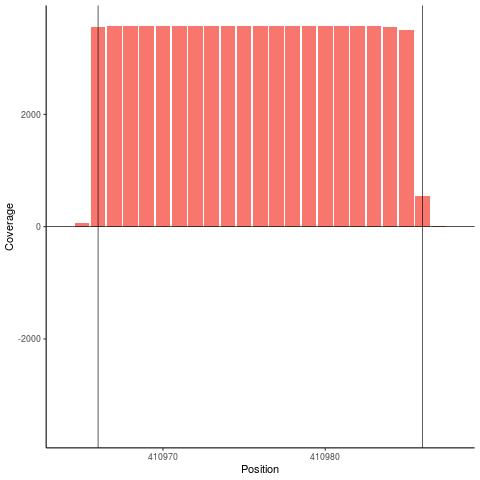

<style type="text/css">

body{ /* Normal  */
      font-size: 12px;
  }
td {  /* Table  */
  font-size: 8px;
}
h1.title {
  font-size: 38px;
  color: DarkRed;
}
h1 { /* Header 1 */
  font-size: 28px;
  color: DarkBlue;
}
h2 { /* Header 2 */
    font-size: 22px;
  color: DarkBlue;
}
h3 { /* Header 3 */
  font-size: 18px;
  font-family: "Times New Roman", Times, serif;
  color: DarkBlue;
}
code.r{ /* Code block */
    font-size: 12px;
}
pre { /* Code block - determines code spacing between lines */
    font-size: 14px;
}
</style>


<br>
__smartPARE__ is an R package designed for sRNA cleavage confirmation based on degradome data. smartPARE utilizes deep sequencing convolutional neural networks (CNN) to segregate true and false predictions of sRNA cleavage data produced by any sRNA cleavage prediction tool. 


 
__Overview__ - smartPARE consists of the 3 following stages: 

1. Generation of cleavage windows 
1. Cleavage window training
1. Cleavage confirmations  
  

<br>

--------

# Installation

```{r setup, include = FALSE}
knitr::opts_chunk$set(
  collapse = TRUE,
  comment = "#>",
  fig.align="center", 
  warning=FALSE, 
  message=FALSE, 
  idy.opts=list(width.cutoff=120))
library(smartPARE)
```

```
#Installation requires devtools
#install.packages("devtools")

#Install smartPARE
devtools::install_github('kristianHoden/smartPARE')
#Load smartPARE
library(smartPARE)
```
--------

## Example images and model data

<br>
To help you set up smartPARE we have included example data and our final model in the package dir (`smartPAREdir <- system.file(package = "smartPARE")`). Example data consist of training images in the dir `smartPAREdir/example/train`. These are arranged in categories described in the _Cleavage window training_ section. Example evaluation images are located in `smartPAREdir/evaluate_smart/`. Our final model is located in `smartPAREdir/model/`. Please see the _Cleavage confirmations_ section for further details how to apply it.
<br>


# Generation of cleavage windows

<br>
smartPARE identifies cleavages based on images of the sRNA cleavages sites (windows). The windows are created from degradome sequencing data transcript-aligned bam-files. The standard length of dagradome-seq reads are 20 nt. Hence, the default windows are generated from an area 1 nucleotides (nt) upstream the cleavage site to 21 nt downstream. The narrow mariginal to the proposed cleavage site reads to exclude as much noise as possible but still include the characteristic cleavage block (seen in the following image).  <br>



```
smartPARE_cleavageWindows(dirO = "pathOut/dir_smart"),
cleavageData = cleavageDataDataset,
aliFilesPath = "path/bamTranscriptome/",
aliFilesPattern1 = "pattern1.sorted.bam$",
aliFilesPattern2 = "pattern2.sorted.bam$",
ylim1 = 5,
edgesExtend1 = c(1,21),
gffTrans = gffTrans)
```
__Parameters:__

`gffTrans` - a dataframe of your imported gff with V10 = transcript ID. See for example extendGffTrans for example

`aliFilesPattern1` - regular expression defining the pattern of the first degradome bam file

`aliFilesPattern2` - regular expression defining the pattern of the second bam file

`dirO` - output path. Please end the path with _extension  to make the dirs identifiable by smartPARE.

`cleavageData` - a dataframe containing at least columns genesT (the target genes) and posT (target position in the transcript)

`edgesExtend1` - Nt positions in relation to the cleavage site that are included in the images. Witten in the format: `c(upstream,downstream)`. Default is c(1,21).


`ylim1` - The minimum plotted height on the y-axis. In practise this means that a lower "cleavage block" might not  be recognized by the CNN. This to exclude potential false positives caused by noice.

`aliFilesPath` - path to the bam files of the user defined degradome. 

__Output:__

Images displaying in the output dir `dirO` the read coverage surrounding the cleavage site labeled `transcriptID_cleavagePosition`   

--------

# Cleavage window training

This stage is only necessary if deciding to create a new CNN model. Our pre-trained model is found in `smartPAREdir/model/CNNmodel.h5")`


__Preparation:__ 

An example of the following instructions is seen in `smartPAREdir/example/train`
*   Create a directory called train with three subdirs called goodUp, goodDown and bad. 
* Collect manually identified images of true cleavages on the 5' strand in the goodUp subdir.
* Collect manually identified images of true cleavages on the 3' strand in the goodDown subdir.
* Collect manually identified images of false cleavages in the the bad subdir. 
* __N.B.__ Ensure to get as great variation as possible among the images of each subdir.  
```
smartPAREdir <- system.file(package = "smartPARE")

modelData <- smartPARE_train(homePath1 = paste0(smartPAREdir,"/example/"),
                             pixels1 = 28,
                             search_bound = list(denseLoop = c(0,4),  
                                                 epochs2 = c(100, 300),  
                                                 batch_size2 = c(32,128),  
                                                 dropout2 = c(0, 0.3),  
                                                 validation_split2 = c(0.1,0.4),  
                                                 convolutionalLoop = c(1,4),  
                                                 NO_pooling2 = c(1,2)),
                             n_iter = 1)
```                             
__Parameters:__

`homePath1` Path to the root directory of the train directory mentioned above.

`pixels1` Number of pixels each each image will be converted to
`search_bound` List of min and max values for the following variables: denseLoop2, epochs2, batch_size2, validation_split2, convolutionalLoop2 and NO_pooling2

`n_iter` Number of iterations the Bayesian optimization will run, each run creating a model


__Output:__

`modelData` contains a list with the following 4 entries:

1. `$Best_Par` shows the hyperparameters for the best performing model. 

1. `$Best_Value` displays the score of the best model. The score is based on the inverted loss of the model.  

1. `$History` the history of hyperparameters for all the  created models.

1. `$Pred` the inverted loss of the cross-validated data.  

Each created model is witten into _homePath1/bayesmodels/_ e.g `smartPAREdir/example/bayesmodels/`, where a subdir ("pdf") with pdfs displaying the performance of each model also is found. The model names in the directory is based on the iteration order followed by then accuracy (0-1), then loss, then the value of each hyperparameter. This makes it possible to identify the performance and setting of the model even if the `modelData` info is lost.     


--------

# Cleavage confirmations  

__Preparation__
Gather images that you want to evaluate in subdirs to your wd (homePath1) at a certain level of recursion. Please end the dirs with _extension e.g. example_smart. The underline will be identified by smartPARE indicate that these dirs contains cleavage images. In an interaction study you might for example have cleavages from 2 different species gathered in different subdirs (specie1 & specie2). Maybe you also have different timepoints for each specie (tp1 & tp2). You might then gather your images in homePath1/specie1/tp1/ etc. The level of recursion will then be 3.  

Load the preferred model according to one of the following: 
 
<ol type="a">
  <li>If you designed your own model based on the example images
  
```model <- keras::load_model_hdf5(paste0(smartPAREdir, "/example/bayesmodels/fillInModelName.h5"))```</li>
  <li>If you are using our final model  
```model <- keras::load_model_hdf5(paste0(smartPAREdir,"/model/CNNmodel.h5"))```</li>
</ol>


View the loaded model
```
`model %>% summary()` 
```

Define the directories you want to examine

```
#E.g. choose to evaluate the example evaluation data   
homePath1 <- paste0(smartPAREdir,"/example/")

extDirs <- unique(dirname(list.files(homePath1,rec=T)))  
```

Exclude the training dirs (or other dirs in the same path) 
```
if(any(which(startsWith(prefix = "train",extDirs))))
extDirs <- extDirs[-which(startsWith(prefix = "train",extDirs))]
if(any(which(startsWith(prefix = "bayesmodels",extDirs))))
extDirs <- extDirs[-which(startsWith(prefix = "bayesmodels",extDirs))]
if(any(which(startsWith(prefix = ".",extDirs))))
  extDirs <- extDirs[-which(startsWith(prefix = ".",extDirs))]
rootExt <- paste0(homePath1,extDirs)  
```
Examine the cleavage images in rootExt dirs. `pixels` must be the same as when creating the model. Our model was based on 28 pixels.  
```
smartPARE_examineCleavages(examinePath = rootExt, model = model,pixels = 28) 
```


Construct a list of the true cleavages of images in recursive subdirs to homePath1. Example images are once again found in `smartPAREdir/example/evaluate_smart/`.      
```
smartPARE_ListTrue(pathToTrue = homePath1)    
```

__Output__

Output will be written to your homePath into a dir called "subdir"_results, e.g. example_results 

Extract the information about the true cleavage windows from your results file
```
trueCleavagesDf <- smartPARE_parse(smartPAREresultFile = paste0(homePath1,"example_results/true.txt"))
```

__Output__

`trueCleavagesDf` contains the following four columns that can be used to filter out false cleavage sites in the dataset used for generating the cleavage images:

* ds - (dataset) based on the name of the dir the cleavage images were stored in
* posT - cleavage position in the transcript
* ext - the extension of the cleavage images
* transcript - transcript ID    

```{r,echo = FALSE}
knitr::kable(read.csv('../inst/example/trueCleavagesDf.csv',sep =  " "), format = "simple")
```
